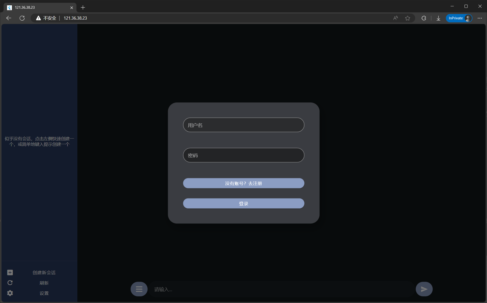
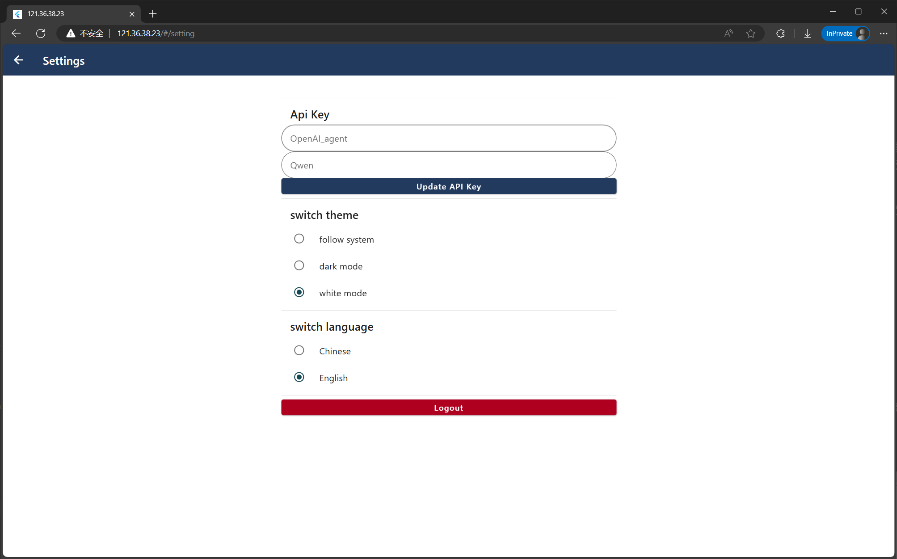
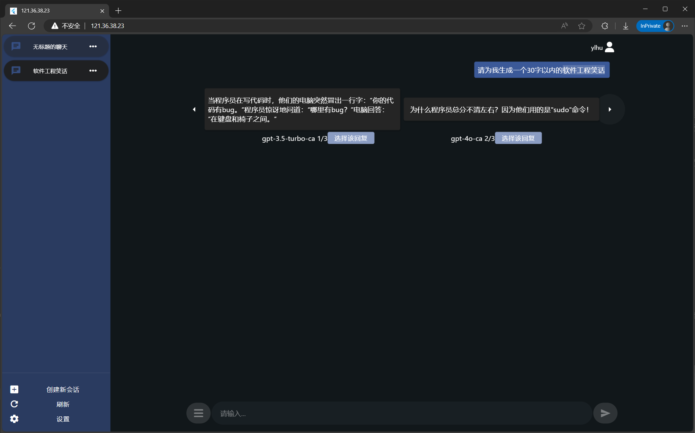

# 1sLLM

一站式大模型访问：适用于实验室等小型网络环境的1sLLM服务器。部署后用户可以简便快捷地与多个大模型同时交互（已支持OpenAI_agent、Qwen），比较生成内容，并随时切换。通过用户提供的API接口，将用户的提问同时发送给多个LLMs处理，然后将不同的回答整理后反馈给用户，提升访问效率和用户体验效果。

目标用户：同时使用多个大模型，需要频繁与模型交互，并希望以简便的方式获得最佳答案的人。

核心功能：

* **对比对话并列呈现**
* ApiKey与历史会话管理
* 舒适的网页界面

使用方法：

* 软件要求：Python，Flutter，MongoDB
  * 前端相关的Flutter构建和运行参见[前端README](frontend/ones_llm/README.md)
  * 后端相关的Python依赖参见[后端requirements](/backend/requirements.txt)，MongoDB安装最新版本即可

网页截图：

